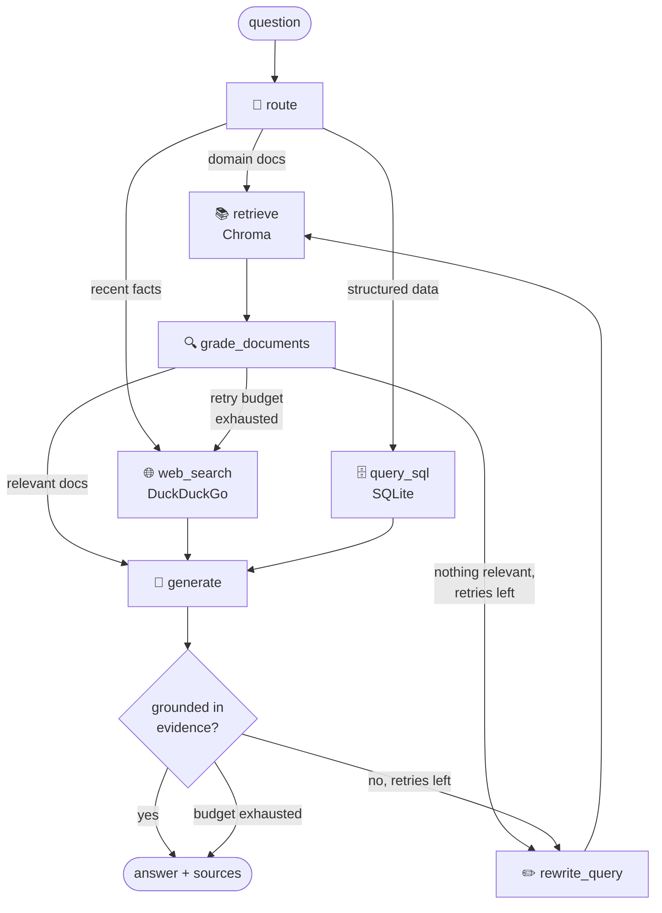

# 🧭 Multi-source Agentic RAG

An **agentic RAG system** built with [LangGraph](https://github.com/langchain-ai/langgraph) that doesn't just retrieve-and-generate — it **decides where to look, judges its own evidence, and corrects itself** before answering.

**100% open source. No API keys. Runs fully local on CPU.**

- 🧠 LLM: any [Ollama](https://ollama.com) model (default: `qwen2.5:3b`, ~2 GB, CPU-friendly)
- 🔤 Embeddings: multilingual `sentence-transformers` (works in English and Spanish)
- 🗂️ Vector store: [Chroma](https://www.trychroma.com/) (embedded, zero config)
- 🌐 Web search: DuckDuckGo (no API key)
- 📊 Evaluation: [RAGAS](https://docs.ragas.io/) — faithfulness, answer relevancy, context precision & recall

## How it works

Each question flows through a LangGraph state machine that makes explicit decisions instead of following a fixed pipeline:



1. **Adaptive routing** — a structured-output LLM call sends the question to the vector store, a SQL database, or web search.
2. **Retrieval grading** — every retrieved chunk is judged for relevance; irrelevant ones are discarded before generation.
3. **Query rewriting** — if nothing relevant survives, the query is reformulated and retried (bounded), then falls back to web search.
4. **Hallucination check** — the answer is verified against the evidence before being returned; ungrounded answers trigger a self-correction loop.
5. **Guaranteed termination** — every loop is bounded by a retry budget (`MAX_RETRIES`, default 2).

## Quickstart

Requirements: Python **3.10+** and [Ollama](https://ollama.com/download).

```bash
# 1. Pull the local model (~2 GB)
ollama pull qwen2.5:3b

# 2. Install
git clone https://github.com/Slahnia/agentic-rag.git
cd agentic-rag
python -m venv .venv && .venv\Scripts\activate    # Windows
pip install -e ".[ui,eval,dev]"

# 3. Create the sample SQL database, load the sample CSV and index the sample docs
python scripts/create_sample_db.py
agentic-rag-ingest-csv
agentic-rag-ingest

# 4. Chat!
streamlit run app.py        # web UI with live agent steps
# or
agentic-rag -v "What is retrieval grading?"        # CLI
```

Try questions that exercise each route:

| Question | Route taken |
|---|---|
| "What is retrieval grading and why is it useful?" | 📚 vectorstore |
| "Which product had the most sales in Spain?" | 🗄️ SQL |
| "What happened in the news today?" | 🌐 web search |

### Bring your own data

**Text documents** (`.md`/`.txt`/`.pdf`): drop them into `data/documents/`, run `agentic-rag-ingest`, and update `KB_DESCRIPTION` in `.env` so the router knows what the knowledge base contains.

**Tabular data** (`.csv`/`.xlsx`): text embeddings are the wrong tool for aggregations — "which product sold the most?" needs exact SQL, not an LLM doing arithmetic over text chunks. Drop your files into `data/tables/` and run:

```bash
agentic-rag-ingest-csv
```

Each file becomes a SQLite table (named after the file). The command prints a ready-made `SQL_DESCRIPTION` line for your `.env` — set it so the router sends numerical questions to SQL.

## Evaluation

The eval harness runs the full agent over [`evaluation/dataset.json`](evaluation/dataset.json) and scores it with four RAGAS metrics:

```bash
python evaluation/run_evaluation.py
```

| Metric | What it diagnoses |
|---|---|
| **Faithfulness** | Is every claim in the answer supported by the evidence? (hallucination) |
| **Response relevancy** | Does the answer actually address the question? |
| **Context precision** | Are the relevant chunks ranked at the top? (retriever ranking) |
| **Context recall** | Does the retrieved context contain everything needed? (ingestion/retrieval) |

Per-question scores are written to `evaluation/results.csv`. Reading the metrics **together** localises the failure: low recall + high faithfulness → retrieval is the bottleneck; high recall + low faithfulness → the generator ignores its evidence.

### Current results

On this repo's sample KB and [dataset](evaluation/dataset.json) — agent = `qwen2.5:3b` on CPU, judge = `qwen2.5:7b`:

| Metric | Score |
|---|---|
| Faithfulness | 0.89 |
| Response relevancy | 0.81 |
| Context precision | 0.88 |
| Context recall | 0.77 |

Read the per-question CSV, not just the averages — that's where the diagnosis is. In this run: one question scores 0.0 relevancy on an answer that is plainly correct and on-topic (LLM-as-judge metrics stay noisy even with a decent judge), and one shows a genuine retrieval miss (context recall 0.0) worth fixing. Treat scores as regression signals across changes, not absolute truth.

### The judge matters (measured, not assumed)

The judge defaults to the same 3B model the agent uses, and that turned out to be measurably unreliable: in an earlier run it scored **faithfulness 0.0** on an answer that was near-verbatim from the source document (full context retrieved, recall 1.0). Rescoring the *same answers* with a 7B judge moved faithfulness from **0.50 to 0.83** — the agent wasn't hallucinating; the judge couldn't decompose answers into claims and verify them, which is exactly what faithfulness requires. Simpler judgments (relevancy, precision, recall) barely moved between judges.

Fix: keep the small model for the agent, use a larger one only as judge (`EVAL_MODEL=qwen2.5:7b`). Evaluation is offline, so the extra latency doesn't matter.

One more CPU-specific pitfall, also measured: RAGAS fires judge calls in parallel, but CPU inference serialises them, so queued calls hit the request timeout and leave NaN scores. The harness pins `RunConfig(timeout=600, max_workers=1)` to get a complete score grid.

## Design decisions

- **Graders reason before they judge.** Forcing a 3B model to emit an immediate structured yes/no made it reject obviously relevant chunks (0/4 relevant with the answer verbatim in the KB). Letting it think briefly and parsing a trailing `VERDICT: yes|no` fixed grading with the same model — chain-of-thought is not optional at this size. Parse failures default to the *safe* verdict so grading noise can never discard all evidence or trap the graph in a loop.
- **Every self-correction loop is bounded.** Rewrite attempts are capped and the vectorstore path falls back to web search, so the graph always terminates — no runaway LLM-call loops.
- **CPU latency shaped the architecture.** Each grading step is an extra LLM call (seconds on CPU). The system keeps the two highest-value checks (document relevance, answer grounding) and skips a separate answer-usefulness grader.
- **SQL is read-only by construction.** Generated queries are validated to be single `SELECT`/`WITH` statements with no DDL/DML keywords before execution ([`tools/sql.py`](src/agentic_rag/tools/sql.py)).
- **SQL self-corrects, and can use a bigger model.** Failed queries (syntax errors *and* suspicious empty results — usually a wrong JOIN) are fed back to the model with the error for a bounded number of attempts. Text-to-SQL proved to be the hardest task for the 3B model: it fixed its MySQL-isms on retry but never let go of a wrong JOIN, while `qwen2.5:7b` wrote the correct query first try. Set `SQL_MODEL=qwen2.5:7b` to upgrade only this route — the rest of the agent stays on the fast 3B.
- **Honest failure over confident nonsense.** If a source returns nothing, the generator is instructed to say "I don't know" rather than fill gaps from parametric memory. (Verifying this systematically with genuinely unanswerable eval questions is still on the roadmap — the current dataset doesn't include them yet.)
- **Testable control flow.** Routing decisions are pure functions over the graph state, unit-tested without any model running (`pytest tests/`).

## Project structure

```
agentic-rag/
├── app.py                      # Streamlit chat UI (live agent steps)
├── src/agentic_rag/
│   ├── config.py               # settings via env vars / .env
│   ├── ingestion.py            # load → chunk → embed → Chroma
│   ├── tabular.py              # CSV/Excel → SQLite tables
│   ├── cli.py                  # terminal interface
│   ├── graph/
│   │   ├── state.py            # shared GraphState
│   │   ├── chains.py           # router, graders, rewriter, generator
│   │   ├── nodes.py            # node functions + routing decisions
│   │   └── build.py            # graph assembly
│   └── tools/
│       ├── web_search.py       # DuckDuckGo source
│       └── sql.py              # text-to-SQL source (read-only guard)
├── evaluation/
│   ├── dataset.json            # eval questions + ground truths
│   └── run_evaluation.py       # RAGAS harness
├── data/documents/             # knowledge base (sample docs included)
├── scripts/create_sample_db.py # sample SQLite database
└── tests/                      # control-flow & safety unit tests
```

## Docker

```bash
docker compose up -d
docker compose exec ollama ollama pull qwen2.5:3b   # first time only
# open http://localhost:8501
```

## Roadmap

- [ ] **Plan-and-execute router (v2)** — today each question goes to exactly one source; a question like *"does our best-selling product have good reviews online?"* needs SQL (the best seller) **then** web search (its reviews). That requires decomposing the question into chained sub-tasks and threading intermediate results between sources — a significant jump in complexity, and the natural next level for this graph.
- [ ] **GraphRAG route** — a fourth data source for the router: extract entities and relations from the documents into a knowledge graph and retrieve by traversing connections. Complements vector search for questions whose answer lives in the *relationships across* many documents rather than in any single chunk.
- [ ] **SQL intent grader** — the generated query ships with the answer as its evidence record (visible in the UI), and syntax errors and empty results already self-correct, but nothing automated verifies the query matches the *question's intent*: an exact answer to a wrongly authored query passes every remaining check. A small reason-then-verdict grader comparing question and query would close the gap that skipping the grounding check on the SQL route leaves open. *(Credit: raised by a reviewer on LinkedIn.)*
- [ ] Hybrid search (BM25 + dense) with reranking — there is already a motivating case in the eval results: question 5 of the dataset is a genuine retrieval miss (context recall 0.0) that keyword search would likely catch
- [ ] Conversation memory (multi-turn) via LangGraph checkpoints
- [ ] Observability with self-hosted Langfuse
- [ ] Add genuinely unanswerable questions to the eval dataset, to verify the system says "I don't know" instead of hallucinating. Needs design: standard RAGAS metrics score honest refusals awkwardly (an "I don't know" has no claims to ground), so these cases likely need their own check.
- [ ] Synthetic eval-set generation with RAGAS `TestsetGenerator`

## License

[MIT](LICENSE)
